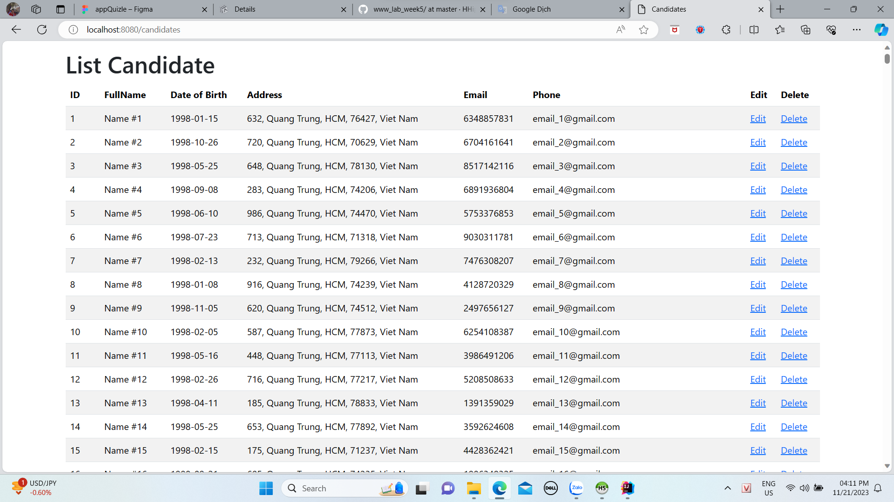
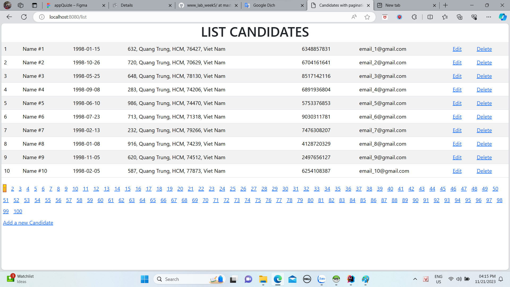
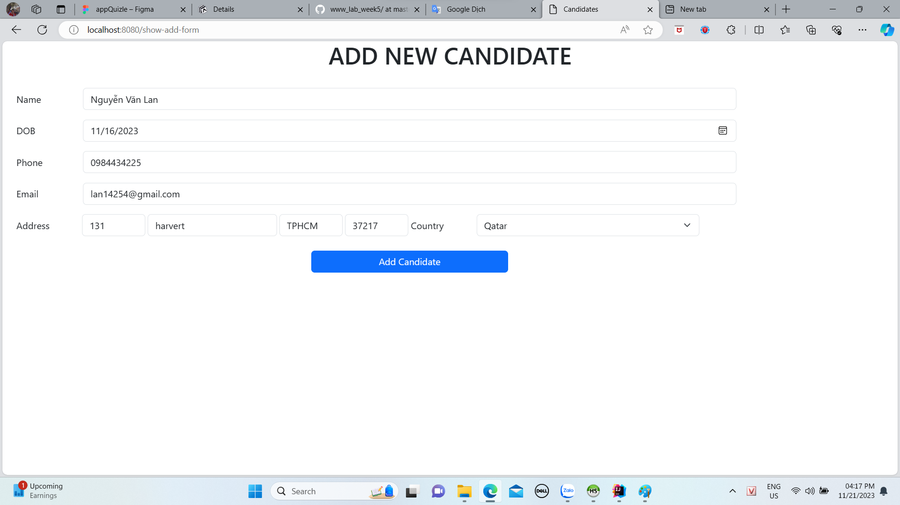
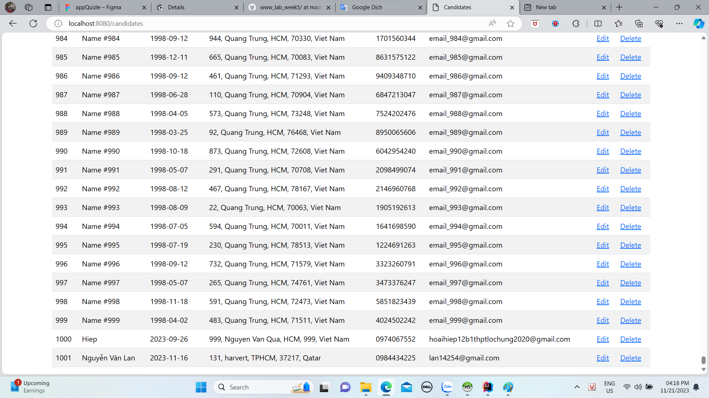
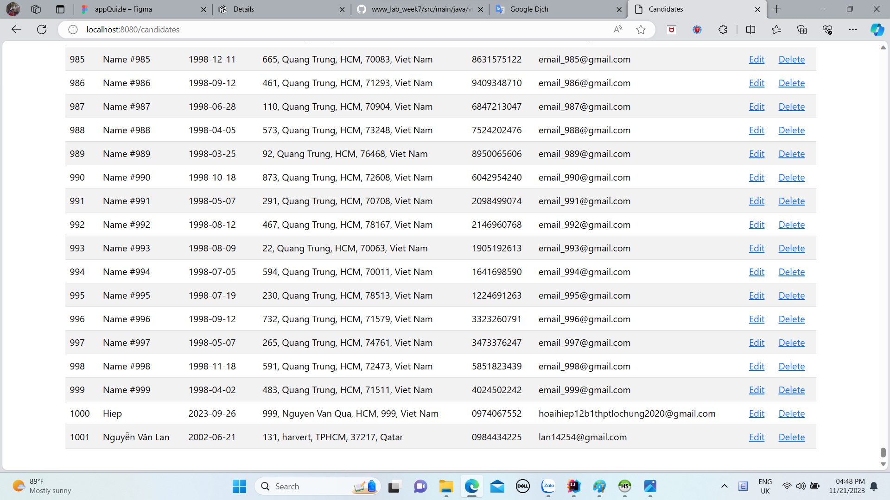
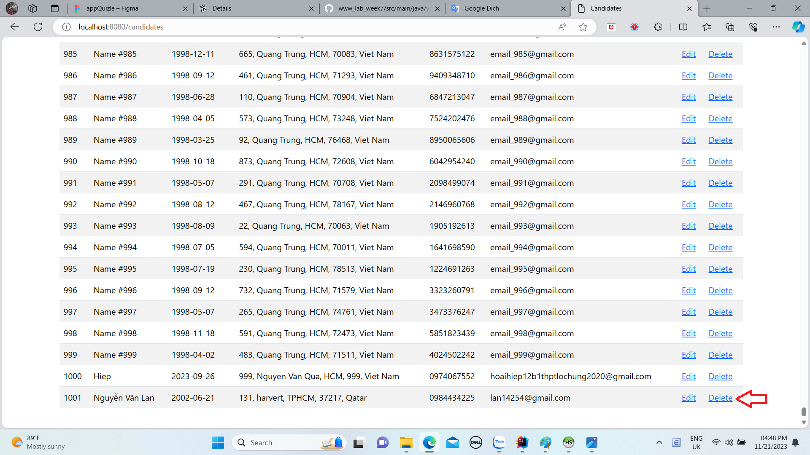
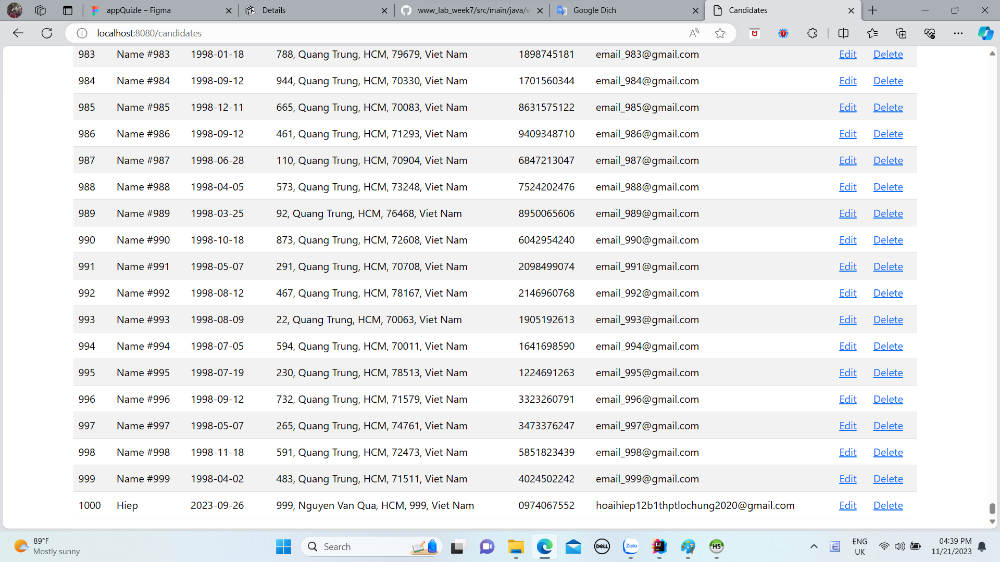

# www_lab_week5
1.Danh sách candidate không phân trang:

2.Danh sách candidate có phân trang:

3.Thêm candidate:

4.Candidate vừa thêm:

5.Sửa thông tin candidate(Sửa ngày sinh):

6.Thông tin sau khi sửa:

7.Xóa candidate:

8.Sau khi xóa:
